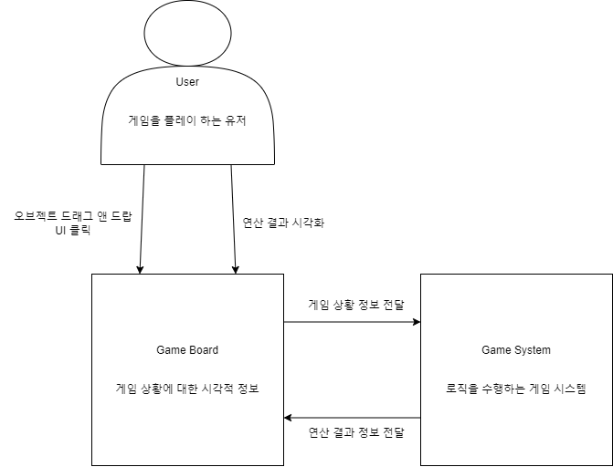
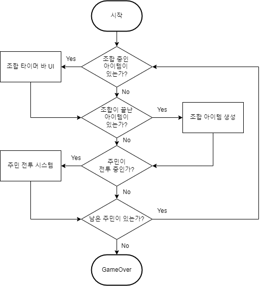
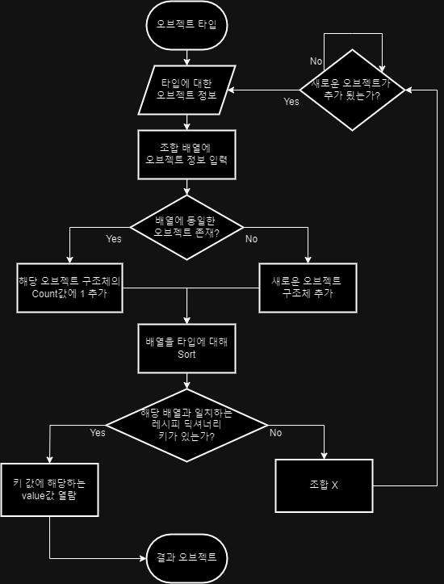

# 개요
- 장르 : 솔리테어 건설 시뮬레이션
- 제작 기간 : 8일 (240925 ~ 241002)
- 제작 인원 : 1인
- 참조 게임 : 스택랜드(Stacklands)

카드를 수집해 카드를 조합시키며 식량을 확보하고 건물을 건설하여 확장시키며 몰려오는 적들과 싸우는 마을 건설 게임.

# 기능
1. 조합 논리 알고리즘
2. 오브젝트 드래그 앤 드랍
3. 오브젝트 스택
4. 오브젝트 조합
5. 오브젝트 유형에 따른 오브젝트 조합
6. 소비 오브젝트
	- 음식, 장비
7. 오브젝트 내구도
	- 오브젝트 사용 횟수
	- ex) 3회 채집 가능한 바위 등
8. 코인, 상점 시스템 
9. 동물 카드
10. 전투 시스템
11. UI 
12. 일차 시스템
13. 배속 시스템

# 기능 설계
### 조합 논리 알고리즘

- 두 개의 딕셔너리(오브젝트, 레시피)를 사용
- 오브젝트가 담겨있는 배열 형태의 키를 통해 레시피 딕셔너리 열람 가능
	- 배열 형태의 키는 참조값이 서로 다르기 때문에 string 변환 후 해당 string을 키로 사용
- key값에 대한 value값으로 조합 오브젝트 획득 가능

## 오브젝트 드래그 앤 드랍

- 마우스 클릭 시 , 해당 위치의 Object 레이어를 가진 콜라이더가 있었다면 해당 오브젝트를 선택
- 마우스를 움직이면 해당 마우스 위치로 오브젝트의 position 변경
	- 코루틴으로 레이캐스트를 쏜 뒤. 해당 위치로 Lerp 이동
- 마우스 클릭 해제 시 오브젝트 선택 해제

# 오브젝트 스택

- 다른 오브젝트 위에 올려놨을 시에 해당 오브젝트의 기준점 위치에 오브젝트 배치 및  해당 오브젝트의 자식 오브젝트로 들어감
	- 자식 콜라이더가 있는 경우 콜라이더의 z크기를 0.01로 바꾼다
	- 자식 콜라이더가 없는 경우 콜라이더의 z크기를 1로 바꾼다
	- 자식 오브젝트는 부모 오브젝트를 Lerp로 따라다님
	- 또한 자식 오브젝트가 있는 경우 콜라이더를 트리거로 바꾼다
		- 부모와 자식끼리 콜라이더가 겹쳐서 예측할 수 없는 물리엔진 버그 발생
- 해당 최상위 부모 오브젝트의 조합 배열에 본인 오브젝트를 등록
- 스택에서 빠지면 해당 오브젝트 배열에서 제거
- 본인의 자식 오브젝트들도 같이 제거
- 재귀함수를 통해 최상위카드 (Top)와 최하위 카드(Bottom) 등록
- 스택을 쌓을시 본인+자식 들의 Top카드를 해당스택의 Top카드로 변경 후 본인 + 부모 카드들의 Bottom카드를 본인의 Bottom 카드로 등록
- 클릭하여 스택에서 빼낼 시 본인+자식들의 Top카드들을 본인으로 변경 원래 스택의 Bottom을 맞 부모 카드로 변경
- 스택 순서에 따라 Order In Layer 변경
	- 스택에 올려두었을때 부모의 레이어보다 1 추가
		- 자식들 또한 동일한 작업을 해야함
	- 스택에서 빼냈을때 레이어를 다시 0으로 초기화
		- 자식들 또한 부모의 레이어에 따라 설정을 해야함
	- 클릭 시에는 레이어를 1000(높은 수) 로 변경하여 가장 상단에 보일 수 있게 해야함

## 오브젝트 조합

- 최상위 부모 오브젝트에서 조합 리스트를 관리
- 최상위 부모 오브젝트가 교체될 시 리스트 업데이트
	- 최상위 부모 오브젝트에서 본인을 빼고, 교체된 최상위 부모 오브젝트 리스트에 본인을 추가
- 리스트에 추가하거나 뺄 때 오브젝트들의 리스트를 조합 논리 알고리즘의 키로 변환
- 일치하는 키가 존재 할 시 결과 오브젝트 생성
	- 제작 시간 존재
	- 리스트에서 빼거나 추가가 없을 때, 타이머 초기화를 막아야 함.

- 오브젝트 생성 시 주변에 오버랩을 쏜뒤 감지되는 bottom의 오브젝트(트리거가 아닌 콜라이더를 가진)가 본인의 데이터 값과 같다면 아래로 들어감
	- 감지되는 동일 오브젝트 데이터가 없다면 랜덤 생성
	- OverlapSphere 를 통해 감지, isTrigger가 False인 경우 해당 오브젝트의 데이터값 비교 같다면 아래로 들어감

# 유형에 따른 오브젝트 조합

- 유형
	1. 소모되는 오브젝트
		 - 조합 시에 해당 게임 오브젝트 삭제
	2.  소모되지 않는 오브젝트
		 - 조합 시에 해당 게임 오브젝트가 사라지지 않음
		 - 몇몇 제련소같은 도구? 카드는 부모를 둘 수 없고 특정 종류의 카드만 자식으로  둘 수 있음
			-  공장형 오브젝트
			- 해당 카드들은 바로 밑 자식과만 조합을 한다
				- ex) 제련소 아래에 철광석 10개가 있어도 제련소+철광석1개 가 조합이 되어 철 1개를 만들어야 함
			- 공장형 카드는 부모 카드를 둘 수 없다(본인이 가장 탑 카드)
	1. 조합에 사용되지 않는 오브젝트
		- 해당 오브젝트는 부모 오브젝트 및 자식 오브젝트를 둘 수 없음
		- canCrafting 같은 bool 변수를 통해 스택화 방지
- CardCombine를 상속받는 클래스 생성
- CardCombine는 추상클래스 조합 후에 각각의 작동을 추상메서드로 구현
	- 스택의 가장 아래부터 시작
	- **소모되는 오브젝트의 경우  
		- 자식의 부모를 본인의 부모로 교체
		- 부모의 자식을 본인의 자식으로 교체
		- 본인이 바텀일경우
			- 맞부모의 바텀을 맞부모 자신으로 교체
		- 본인이 바텀이 아닐경우
			- 맞부터의 바텀을 본인의 바텀으로 교체
		- 본인을 조합리스트에서 제거
		- 본인이 탑일 경우 , 또한 자식 카드가 있는경우
			- 본인의 조합 리스트를 맞자식의 조합리스트에 복사
			- 맞자식의 탑을 맞자식 본인으로 변경
			- 맞자식의 자식들의 탑을 변경
		- 게임 오브젝트 삭제
	- **소모되지 않는 오브젝트의 경우**
		- 부모카드가 있는 경우
			- 맞부모의 바텀을 본인의 바텀으로 변경
	- **공장형 오브젝트**
		- bool 변수를 통해 스택 등록 금지
		- 바닥이 바뀔 때 마다 위에서 부터 아래로 조합리스트 재입력
			- 팩토리 바텀배치 : 조합 아이템의 가장 아래를 팩토리 바텀으로 선택
			- 조합이 가능할때 조합 시작
			- 조합리스트의 재입력이 일어나고 조합이 가능하면 조합 취소 안함
			- 조합리스트 재입력 후 조합 가능 카드가 없으면 조합 취소
		- 조합이 끝났을때 마지막 재료을 바닥으로 설정하고 재료 카드들 처리
		- 잠깐 뒤에(코루틴)  자식을 순회하며 리스트에 자식들을 순회하며 리스트 재입력
			- 조합이 가능한 시점에서 다시 조합 시작
	- **조합불가 오브젝트**
		- bool 변수를 통해 부모 자식 등록 금지

# 소비 오브젝트
- 주민 카드는 음식을 먹거나 장비를 착용 할 수 있음
- 음식카드, 장비카드
	- 평상 시에는 소모되는 오브젝트
	- 주민에게 드래그 앤 드랍시 해당 카드 사용, 주민의 포만감을 회복 시키거나 주민의 능력치를 강화한다
- 드래그 앤 드랍했을 때 본인의 자식이 없는 단일 카드상태일때만 사용 가능
- 스택을 쌓았을때 부모의 데이터가 주민이었다면 소비 오브젝트로 작용

# 오브젝트 내구도
-  소모되는 오브젝트에 대해 내구도 적용
	- 0인 경우 : 소모성은 1회용, 공장형은 내구도 무한
	- n인 경우 : n개의 조합 횟수를 가진 오브젝트
- 부숴지지 않았을때는 소모되지 않는 오브젝트거나, 팩토리 오브젝트처럼 작용해야함
	1. 자식의 탑을 자식 본인으로 교체
	2. 하위 스택들의 탑을 일괄적 교체
	3. 자식 조합리스트를 초기화
	4. 자식 조합 리스트에 하위 스택들 등록
	5. 자식의 부모를 본인의 부모로 교체
		- null 로 해도 되지만 이후 확장성을 위해 해당 방식 사용
	6. 게임오브젝트 파괴 후 retrun으로 함수 강제 종료

# 상점 시스템
- **코인**
	- 카드 데이터에는 지정된 가격이 있음
	- 판매에 스택으로 올리면 가격만큼 코인 생성
	- 그렇다면 어떻게 가격만큼 코인을 생성하게 하는가?
	- 로직
		- 바텀이 바뀌었을때 작동
		1. 자식의 가격이 0이 아닌경우
			1. 가격만큼 코인 생성
				- 생성된 코인은 리스트에 넣음
			2. 자식의 자식 캐싱 (있을 경우)
			3. 자식 삭제후 캐싱해둔 값을 자식으로 교체
		2. 자식의 가격이 0인 경우
			1. 못파는 리스트에 해당 객체 추가
			2. 자식의 자식으로 본인의 자식 교체
	    3. 마지막 자식까지 반복
	    4. 코인 리스트 설정과 , 못파는 리스트 설정
		    1. 리스트 인덱스 0번째를 자식으로 지정
		    2. 리스트 인덱스 0번째를 탑카드로 지정
			3. 리스트 인덱스 0번째의 부모를 null로 설정 후 다음 인덱스의 카드를 자식으로 지정(없으면 null)
				-  이때 탑카드의 위치가 맵 안으로 들어올 수 있게 끔, 아래쪽으로 강제 트랜스폼 이동
			4. 다음 인덱스는 교체 및 전 인덱스를 부모로 지정 다음 인덱스를 자식으로 지정(없으면 null)
			5. 판매의 자식 (탑카드)로 해당 자식들의 탑카드 교체\
			6. 마지막 인덱스의 카드로 부모들 바텀 교체
			7. orderLayer 설정
		5. 본인의 자식을 null 바텀을 본인으로 교체한 후 리스트 인덱스 비운 뒤 마무리
- **상점**
	- ShopCombine 지정
	- 로직
		- 바텀이 바뀌었을때
			- 자식부터 맨 아래까지 리스트에 추가
			- 위에서부터 코인인가 아닌가를 체크
				- 코인이면 조합리스트에 코인 해당 코인을 넣는다
					- 만약 조합이 가능하다면 조합을 하고 반복 끊기
					- 해당 마지막 카드부터 끊어야 하기때문에 팩토리 처럼 조합리스트 부분을 따로 구현
					- 조합된 아이템은 아래쪽에 나올 수 있도록 구현
				- 코인이 아니라면 반복끊고 다음 진행
			- 조합에 성공했을때 해당 코인 삭제 연산
				- 캐싱해둔 인덱스의 개수까지 삭제
			- 리스트에 대하여 설정 진행
				1. 리스트 인덱스 0번째를 자식으로 지정
			    2. 리스트 인덱스 0번째를 탑카드로 지정
				3. 리스트 인덱스 0번째의 부모를 null로 설정 후 다음 인덱스의 카드를 자식으로 지정(없으면 null)
					-  이때 탑카드의 위치가 맵 안으로 들어올 수 있게 끔, 아래쪽으로 강제 트랜스폼 이동
				4. 다음 인덱스는 교체 및 전 인덱스를 부모로 지정 다음 인덱스를 자식으로 지정(없으면 null)
				5. 판매의 자식 (탑카드)로 해당 자식들의 탑카드 교체\
				6. 마지막 인덱스의 카드로 부모들 바텀 교체
				7. orderLayer 설정
			- 본인의 자식을 null 바텀을 본인으로 교체한 후 리스트와 조합리스트 비운 뒤 마무리
- **상점 아이템**
	- 상점에서 구매한 아이템
	- 클릭하면 랜덤한 카드가 나옴 
	- 횟수 제한
	- 로직
		- 클릭 시 타이머 시작
		- 언클릭 시 해당 타이머가 0.1초 이하일때
			1. 상점아이템 랜덤카드 리스트에서 랜덤으로 하나를 선택
			2. 해당 카드 생성
			3. 카드 내구도 1감소
			4. 카드 내구도가 0이 될때 해당 카드 삭제
# 전투 시스템
- 몬스터는 부모를 못가지고 자식을 가짐
- 조합 불가 카드
- 잡을수 없는 카드
	- 동물은 잡을 수 있음
- 로직
	- 배틀필드라는 클래스에서 전투를 구현
	- 해당 배틀필드는 오브젝트 풀로 가져와서 전투할떄마다 가져옴
	- 자식은 오직 주민만 가질 수 있음
		- 주민이 아닌 카드는 자동으로 빠져나온다
	- 몬스터 리스트와 주민리스트 지정
		- 몬스터는 몬스터 리스트에 주민들은 주민리스트에 들어감
		- 추가된 모든 인덱스에 대해 탑카드와 바텀카드 본인 지정 후 부모 자식 null 교체
		- 이후 주민카드들에게 자식카드를 가질수 없도록 세팅
	- 전투 시 메인전투 몬스터(리스트 0번) 의 트리거 영역을 크게할 필요가 있음
	- 몬스터와 주민의 위치
		- 몬스터 리스트는 위쪽 벡터에 위치
		- 주민 리스트는 아래 벡터에 위치
	- 전투는 코루틴으로 돌아감 ( 순차적으로 돌아가야되며 전투가 끝날 때까지 반복 해야함 )
		-  주민 리스트부터 순차적으로 몬스터 리스트 랜덤 인덱스 공격
		- 이후 몬스터 리스트에서 주민 리스트 랜덤 인덱스 공격
		- 체력이 0이 된 카드는 리스트에서 본인 제거 후 삭제 처리
		- 어느 한쪽이든 리스트가 0이 되면 전투 종료
	- 몬스터는 전투중이 아닐때 주기적으로 주변 랜덤한 위치로 Lerp 이동함
 
# 일차 시스템
- 일정 시간이 지나면 일차가 지남
-  카드캡
	- 일차가 지났을때 최대 카드 갯수가 정해져있음
	- 카드 갯수가 초과하면 팔거나 버려서 개수를 맞춰야함
- 일차가 지나면 주민들은 음식을 자동으로 먹어 포만도를 채워야 함
- 일차가 끝났을 때 포만도가 0이 아닌 주민은 사망
- 모든 카드는 생성 시에 카드매니저의 카드 리스트에 본인을 등록해야함
	- 추가로 주민 카드는 생성 시에 카드매니저의 주민 리스트에 본인을 등록해야함
	- 음식도 등록해야 할듯
- 삭제시에는 해당 리스트에 본인 삭제
- 일차 리셋후 다시 포만감 2로 초기화
	- 주민은 추가로 현재체력 5를 회복한다
# UI
- 상단 UI
- 좌하단 팝업 UI
- 레시피 UI
- ESC 메뉴 UI

# 진행도

## 240925
- 조합 논리 알고리즘
- 오브젝트 드래그 앤 드랍
- 오브젝트 스택
	- 자식 카드가 초기화 되지 않는 버그 발생
- 오브젝트 조합
	- 타이머 구현 전 까지

## 240926
- Card 클래스 리팩토링
	- 드래그앤 드랍, 모델, 아이템 조합 분리
- 오브젝트 초기 세팅 및 조합 버그 수정
- 오브젝트 조합 타이머 구현
- 오브젝트 스택의 Bottom 구현
- 유형별 오브젝트 조합 일부 구현
	- 소모성 오브젝트 구현
	- 소모되지 않는 오브젝트 구현
	- 공장 오브젝트 구현
	- 조합불가 오브젝트 구현
- 오브젝트 조합 후 자동 수거 기능

## 240927
- 음식먹기 구현
- 오브젝트 스택
	- 스택 순서에 따라 Order In Layer 변경
- 공장형 오브젝트 구조 로직 변경
- 카드 몇개 프리팹 구현
- 마우스 커서 구현
- 오브젝트 내구도 구현
- 결과 아이템 배열형태로 변경
- 프리팹 자동 설정  함수 작성
- 딕셔너리에 카드 데이터, 레시피 데이터 자동 입력 함수 작성

## 240928
- 팩토리 조합 메서드 분리
- 코인, 상점시스템 구현
	- 코인, 판매, 상점까지
	- 코인상자, 상점 아이템 구현 필요

## 240929
- 코인, 상점시스템 
	- 상점 아이템 구현
- 전투시스템 일부 구현
## 240930
- 전투시스템 완성

## 241001
- 전투시스템, 일차시스템
- 카드 프리팹, 데이터 제작
- UI 일부 구현
	- 상단 UI
	- 좌측UI
	- 좌하단 팝업 UI
- 게임 오버 종료조건 추가
- 사운드 구현
- 게임씬 구현